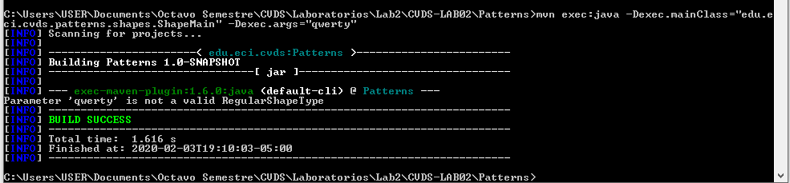

# Laboratorio 2 - Patterns - 2020-1


* Universidad: _Escuela Colombiana de Ingeniería_
* Asignatura:  _Ciclos de Vida de Desarrollo de Software_
* Autor: _Davor Cortés_

## La herramienta Maven

La herramienta Apache Maven se usa para gestionar y manejar proyectos de software. La base de maven para un poyecto es el concepto de un modelo de objeto de proyecto (POM), Maven puede gestionar la compilación, los informes y la documentación de un proyecto a partir de este modelo, que se concreta en el archivo `pom.xml`.


### Crear un proyecto con Maven

* Grupo: edu.eci.cvds
* Id del Artefacto: Patterns
* Paquete: edu.eci.cvds.patterns
* archetypeArtifactId: maven-archetype-quickstart


### Compilar y Ejecutar
* Para compilar ejecute el comando:
```
$ mvn package
```
  Si maven no actualiza las dependencias utilice la opción -U asi:
```
$ mvn -U package
```
* Para ejecutar
```
mvn exec:java -Dexec.mainClass="edu.eci.cvds.patterns.shapes.ShapeMain" -Dexec.args="Triangle"
```

### Pruebas

* Sin parámetros
  

  Este caso no es correcto debido a que se debe especificar el nombre de la figura.
---
* Parámetro: qwerty
  
  Este caso no es correcto debido a que la clase Enumerable `RegularShapeType` no contiene ninguna figura llamada "qwerty".
---
* Parámetro: pentagon
  

  Este caso no es correcto debido a que la clase Enumerable `RegularShapeType` especifica que el nombre de la figura empieza con mayúscula.
---
* Parámetro Hexagon
  

